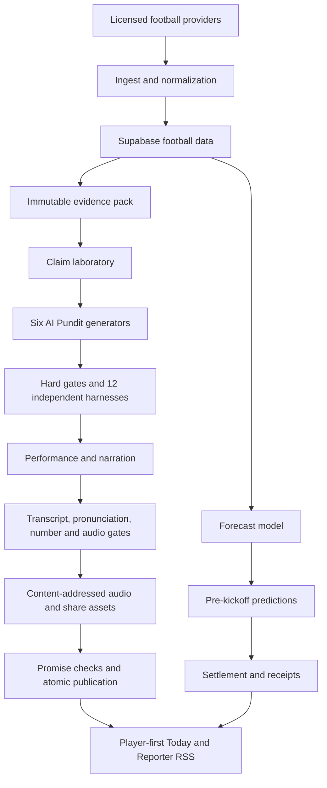
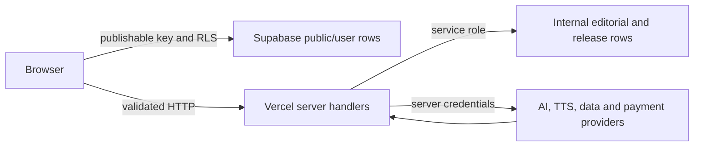

# 03 - Architecture

- **Status:** Current
- **Owner:** Engineering and operations
- **Purpose:** Explain system boundaries, data flow, trust, orchestration, and failure behavior.
- **Last reviewed:** 2026-08-11

## System view

The application is a TanStack Start service running on Vercel's Node runtime. Supabase owns durable data, auth, RLS, and media storage. Provider work runs server-side. The browser reads published records and user-scoped preferences only.

## Bounded contexts

| Context              | Responsibility                                                  | Primary code/data                                      |
| -------------------- | --------------------------------------------------------------- | ------------------------------------------------------ |
| Football data        | Normalize fixtures, results, events, and statistics             | `matches`, `match_events`, `match_stats`, ingest route |
| Editorial evidence   | Seal facts, derivations, provenance, and absent evidence        | `evidence_packs`, `analysis_claims`                    |
| Pundit production    | Select thesis, write, judge, repair, quarantine                 | `pundit_specs`, `pundit_variants`, `harness_runs`      |
| Narration            | Plan delivery, synthesize, verify, master, and store            | voice, lexicon, audio review, asset services           |
| Forecasting          | Train, calibrate, activate, register, and settle                | `forecast_models`, `prediction_ledger`                 |
| Evaluation           | Build held-out corpus and collect blinded reviews               | `evaluation_*` tables and runners                      |
| Release control      | Claim runs, record rehearsals and sign-offs, publish atomically | `editorial_runs`, `rehearsal_runs`, `release_*`        |
| Listener product     | Select pundit, play real media, follow, share, view receipts    | routes, components, user tables                        |
| Legacy compatibility | Archive and old episode generation                              | `episodes`, `drops`, legacy API services               |

## Daily orchestration

[`vercel.ts`](../vercel.ts) schedules ingest, daily rehearsal, and prediction registration. Each HTTP entry point performs two checks:

1. timing-safe bearer authentication using `CRON_SECRET`;
2. a feature-specific execution flag.

The rehearsal route returns `202` with a run ID. Acceptance does not mean success. The durable workflow then:

1. claims the coverage date idempotently;
2. selects the feature match and builds one evidence pack;
3. generates and judges six editorial variants in parallel under a provider semaphore;
4. persists every harness result and repair attempt;
5. renders and verifies six narrated variants in parallel;
6. uploads content-addressed assets;
7. runs the complete publication promise set;
8. records a rehearsal result or publishes all six variants atomically.

Stale claims can be recovered. Completed steps are idempotent. A retry must not create duplicate public content or mutate an immutable prediction.

## Editorial trust boundary

The writer does not receive an open web context. It receives licensed evidence, permitted research concepts, a pundit spec, and failed-beat feedback.

Hard gates cover:

- match, score, entity, number, and consequence identity;
- evidence-to-claim entailment and causal strength;
- unsupported tactics and unavailable context;
- falsifiability and prediction timestamps;
- research originality and prohibited imitation;
- display-script and spoken-script meaning;
- transcript, pronunciation, and audio fidelity.

Qualitative judges score one dimension each. A high humour score cannot rescue weak insight. A high story score cannot rescue an unsupported claim.

## Data and access boundary

- Browser code never receives service-role, model, TTS, cron, or payment secrets.
- Public reads expose only published or explicitly public rows.
- User rows are owner-scoped with RLS.
- Internal editorial, research, evaluation, voice, and release tables are service-role only.
- Public storage contains approved media; write access remains privileged.
- Stripe webhooks authenticate with the raw-body signature. New checkout is separately disabled by launch and billing flags.

## Publication model

`daily_drops` is the current release object. `pundit_variants` is the per-persona product. A variant may be drafted, judged, quarantined, approved, or published. Published variants are protected from mutation.

The database function `publish_daily_drop` is the atomic boundary. It may publish only after the expected six variants, assets, hard gates, harness floors, predictions, and release snapshot exist. A partial daily drop remains internal.

Legacy `drops` and `episodes` support archive behavior. They are not the current six-pundit publication contract.

## Public Today boundary

The browser requests one AI Pundit edition at a time. The response may include the current variant, a latest same-AI-Pundit fallback, match and team IDs, up to three proof cards, and recent published editions. Proof projection reads internal sealed evidence through server-only code and returns plain strings; raw provider payloads and internal evidence objects do not cross the boundary.

An AI Pundit switch is a media transaction. The client preloads the requested audio in a new element, commits the edition and saved preference only after readiness, then releases the previous element. A failure leaves the old edition and preference intact.

Generated avatars are deterministic client-side SVGs seeded by daily-drop and AI Pundit IDs. They require no image provider or new durable data.

## Prediction model

One calibrated forecast supplies shared win/draw/loss probabilities. Pundits can adjust them by no more than five points without extra licensed evidence. Registration must occur before kickoff, and database protection prevents retrospective edits.

Settlement compares the original structured rule to recorded data. Public receipts retain wrong and partly correct calls. `unjudgeable` is valid only when the registered evidence cannot settle the rule.

## Failure semantics

| Failure                  | Product behavior                                                  |
| ------------------------ | ----------------------------------------------------------------- |
| Missing data             | No candidate or an explicit restraint claim                       |
| Unsupported analysis     | Claim rejected before prose                                       |
| Weak qualitative score   | Failed beats repaired or variant quarantined                      |
| Provider outage          | Run remains failed/retryable; nothing silently approves           |
| One persona fails        | Entire drop remains unpublished; failure stays visible internally |
| Asset promise fails      | Atomic publication denied                                         |
| Forecast underperforms   | Model stays inactive and public scores remain hidden              |
| Release evidence missing | Readiness remains blocked                                         |
| Runtime regression       | Roll back app; preserve audit and receipts                        |

## Deployment

- Production: [fulltime.fm](https://fulltime.fm), Vercel project `full-time`.
- Current deployment state: ready, truthful pre-launch.
- Runtime target: Node 24 on Vercel.
- Schedule configuration: `vercel.ts`.
- Database: Supabase project `hzadscrqmyilbisexvyz`.
- Production and billing changes are explicit operator actions, not build side effects.

See [`06-ops.md`](./06-ops.md) for runbooks and [`19-release-state.md`](./19-release-state.md) for current live evidence.
