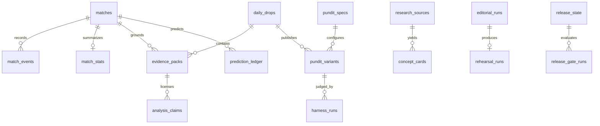

# 04 - Data model

- **Status:** Current
- **Owner:** Data and engineering
- **Purpose:** Map the production schema, ownership, immutability, RLS, and migration rules.
- **Last reviewed:** 2026-08-11

## Authority

The ordered SQL files in [`supabase/migrations`](../supabase/migrations) are the schema authority. This document is a navigation map, not a substitute for the migration that defines a column, constraint, policy, trigger, or function.

Production project: `hzadscrqmyilbisexvyz`. Confirm the project name and reference before every write.

## Domain map

## Table catalog

### Football and legacy application data

| Tables                                    | Purpose                                                | Public access                             |
| ----------------------------------------- | ------------------------------------------------------ | ----------------------------------------- |
| `leagues`, `teams`, `players`             | Licensed entity registry                               | Readable reference data                   |
| `matches`, `match_events`, `match_stats`  | Fixtures, results, recorded events, statistics, season | Readable match data                       |
| `episodes`, `drops`, `synthesis_insights` | Legacy recap and archive publication                   | Published/shipped rows only               |
| `live_commentary`                         | Reserved legacy phase-two shape                        | Read policy exists; feature is not active |
| `voice_corpus`                            | Legacy persona corpus                                  | Internal only                             |

`episodes` and `drops` do not define the current six-pundit release. They remain for archive compatibility.

### User, access, and commercial data

| Tables                | Purpose                                   | Access rule                                              |
| --------------------- | ----------------------------------------- | -------------------------------------------------------- |
| `profiles`            | User preference and retained Stripe state | Owner-scoped; billing columns protected from user writes |
| `follows`             | Team and league follows                   | Owner-scoped                                             |
| `listens`             | Real playback and completion events       | Owner-scoped or constrained anonymous insert             |
| `push_subscriptions`  | Web Push endpoints and delivery state     | Owner-scoped                                             |
| `waitlist`            | Launch-note membership and attribution    | Owner-scoped with guarded ops fields                     |
| `generation_requests` | Legacy on-demand usage ledger             | User-visible allowance, privileged writes                |

New billing is disabled in application code. Retained columns support existing subscriber management and future reviewed reactivation.

The intended Premier-League-only beta is an application-response rule, not a schema migration. Existing non-Premier-League follows remain stored. The current `getTeamsAndLeagues` function has not yet applied the beta restriction, so no document or agent may claim it has shipped.

### Editorial intelligence

| Table                   | Responsibility                                                 | Key invariant                                    |
| ----------------------- | -------------------------------------------------------------- | ------------------------------------------------ |
| `daily_drops`           | Canonical coverage date and publication state                  | One release object per date                      |
| `evidence_packs`        | Facts, derivations, provenance, missing evidence               | Sealed packs cannot mutate                       |
| `analysis_claims`       | Evidence-linked facts, judgments, counterfactuals, predictions | Evidence refs and status required                |
| `pundit_specs`          | Versioned persona doctrine                                     | Only active public specs are readable            |
| `pundit_variants`       | Thesis, script, performance, audio, assets, status             | Published variants cannot mutate                 |
| `harness_runs`          | Judge version, score, evidence span, failure, repair           | Every attempt remains auditable                  |
| `prediction_ledger`     | Pre-kickoff claims, probabilities, rules, settlement, receipt  | Registration locks at kickoff                    |
| `research_sources`      | Rights, use, attribution, approval, expiry                     | Internal only                                    |
| `concept_cards`         | Original analytical concepts linked to sources                 | Approval and source-language comparison retained |
| `pronunciation_lexicon` | Entity pronunciation and verification                          | Launch names need human verification             |

### Operational release gates

| Table                | Responsibility                                                |
| -------------------- | ------------------------------------------------------------- |
| `voice_candidates`   | Licensed auditions and one selected voice per pundit          |
| `audio_reviews`      | Full-length human audio scores and notes                      |
| `forecast_models`    | Training window, baseline, held-out metrics, activation       |
| `team_season_status` | Promoted-team and season priors                               |
| `evaluation_matches` | Founder-approved 60-match corpus                              |
| `evaluation_runs`    | Resumable script-generation batches                           |
| `evaluation_reviews` | Blind persona, preference, comprehension, and quality results |
| `editorial_runs`     | Idempotent daily-run claims and workflow state                |
| `rehearsal_runs`     | Deadline and promise-check outcomes                           |
| `release_signoffs`   | Human and operational approvals tied to revision              |
| `release_state`      | Current product release mode and revision                     |
| `release_gate_runs`  | Immutable readiness evaluations                               |

## Database protections

Key functions and triggers:

- `prevent_sealed_evidence_mutation`: protects sealed evidence packs;
- `protect_prediction_registration`: prevents late or retroactive prediction changes;
- `protect_published_variant`: protects published scripts and assets;
- `claim_editorial_run`: atomically claims an idempotent run and supports stale recovery;
- `publish_daily_drop`: performs the all-or-nothing publication transaction;
- `enforce_profile_billing_guard`: prevents `anon` and `authenticated` callers from self-granting billing state;
- `waitlist_guard`: protects join order and operator fields;
- fixed-search-path migrations harden privileged functions;
- optimized policies cache `auth.uid()` evaluation without widening access.

## RLS and grants

All exposed public tables use RLS. The general policy is:

- public reference and published content: `SELECT` only;
- user data: `auth.uid()` ownership in both policy and query path;
- internal editorial, research, evaluation, and release data: service role only;
- public storage: approved media can be read, while writes require privileged server code.

Never use `user_metadata` for authorization. Never rely on `TO authenticated` without a row ownership condition. Never add `SECURITY DEFINER` to bypass a permission problem.

## Storage

| Bucket     | Content                     | Access                        |
| ---------- | --------------------------- | ----------------------------- |
| `episodes` | Legacy and mastered audio   | Public read, privileged write |
| `share`    | Share cards and share media | Public read, privileged write |

Current assets use content-addressed paths. Do not overwrite a published file in place.

AI Pundit avatars do not use storage. The public component derives stable SVG geometry from the daily-drop and `PunditId` values.

## Migration order

The schema evolves additively:

1. June base schema and magic-engine extension;
2. July billing, waitlist, generation-request, and audio-byte additions;
3. August enrichment and narration additions;
4. `20260808194138_pundit_intelligence_system.sql`;
5. `20260808200000_operational_release_gates.sql`;
6. search-path and auth-RLS hardening migrations.

For a new change:

1. create a timestamped migration with the Supabase CLI;
2. define constraints before policies depend on them;
3. add explicit grants, RLS, and least-privilege policies;
4. add immutability or idempotency protections where publication or audit data is involved;
5. run focused contract tests, migration verification, and database advisors;
6. apply only to the confirmed target;
7. read the result back and regenerate TypeScript types.

Do not drop audit, prediction, receipt, or published-content records during incident response.
