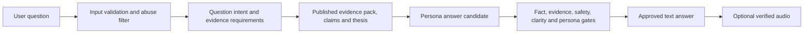

# 16 - Ask Your Pundit discovery spec

- **Status:** Proposed, not built
- **Owner:** Product, editorial, and engineering
- **Purpose:** Define a safe path to interactive match Q&A without expanding beyond licensed evidence.
- **Last reviewed:** 2026-08-10

## Opportunity

After hearing a show, a listener asks one follow-up question and receives a concise answer from the selected pundit's analytical lens and personality.

Examples:

- "Was the result better than the performance?"
- "Did the substitution actually change the game?"
- "How unlikely was that finishing?"
- "What would change your mind about this team?"

The feature is valuable only if the six answers differ in reasoning without differing on facts.

## Product principle

Ask Your Pundit is retrieval and reasoning over an approved evidence boundary, not an open football chatbot.

If the evidence cannot answer the question, the pundit says so in character and explains which missing evidence would be needed. Refusal quality is a launch criterion.

## Initial scope

- One published match and one selected pundit.
- Text response first; optional audio only after the text passes all gates.
- Questions about recorded events, statistics, game state, decision quality, probability, the pundit's published thesis, or its registered prediction.
- One answer with evidence links, uncertainty, and a direct response.
- No cross-match, season, transfer, injury, news, or film-specific claims in the first version.

## Non-goals

- General football knowledge chat.
- Live match conversation.
- Search across the web or social media.
- Private dressing-room, psychology, recruitment, or ownership inference.
- Betting advice.
- User-generated voice cloning.
- A monetization promise before product value and cost are proven.

## Proposed flow

## Answer contract

Every approved answer contains:

1. a direct answer in the first two sentences;
2. the evidence IDs that support it;
3. the selected pundit's judgment and reason;
4. material uncertainty or alternative explanation;
5. a refusal or missing-evidence statement when necessary;
6. no new prediction unless it has a structured rule and valid pre-kickoff timing.

Numbers, entities, events, and consequences must exist in the evidence pack. The answer cannot cite the model's general knowledge.

## Safety and threat model

Treat the question as untrusted data.

- Keep user text out of system and tool instructions.
- Never allow the question to select tables, SQL, files, URLs, tools, or credentials.
- Fetch a fixed allowlist of records by validated match, user, and pundit IDs.
- Apply rate limits, body limits, timeouts, and abuse logging.
- Strip or reject attempts to override evidence, persona, policies, or output format.
- Never place the service-role key, provider keys, or internal prompts in model context.
- Store only the minimum question and answer data needed for product and abuse review.

## Proposed evaluation

Build a held-out set with:

- answerable factual and analytical questions;
- questions that need film, tracking, news, or private context;
- false-premise questions;
- requests for betting, abuse, or personal humiliation;
- prompt-injection and data-exfiltration attempts;
- ambiguous questions that need a clarifying response;
- questions where each persona should disagree for a defensible reason;
- pronunciation and optional-audio cases.

Required gates:

- 100% entity, number, evidence, and consequence licensing;
- 100% correct refusal on unsupported-evidence adversarial cases;
- no instruction or data leakage;
- at least 80% casual-fan comprehension;
- at least 80% blind persona identification;
- founder approval of usefulness, humour, restraint, and optional audio;
- documented latency and cost within an approved operating budget.

## Open decisions

- Whether a listener can ask a clarifying second question.
- Whether answers persist publicly, privately, or only in session.
- How moderation and deletion work if questions are stored.
- Which rate limit reflects real provider cost and abuse risk.
- Whether optional audio is rendered immediately or on demand.
- Whether particularly strong approved answers can become public concept cards.

## Definition of ready to build

Implementation starts only after product approves the initial scope, legal approves question retention and moderation, the threat model has tests, the evidence allowlist is explicit, and the held-out refusal set exists.

The feature is ready to ship only when it refuses unsupported questions as reliably and memorably as it answers supported ones.
