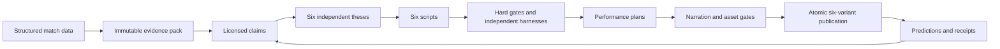

# 18 - World-class pundit system

- **Status:** Current implementation map
- **Owner:** Product and engineering
- **Purpose:** Describe what the six-pundit codebase implements and where its safety controls live.
- **Last reviewed:** 2026-08-10

## Implementation state

The six-pundit pre-launch foundation is implemented, deployed to [fulltime.fm](https://fulltime.fm), and backed by the current additive migrations. Public launch, automated publication, new billing, and public forecast scores remain disabled.

The system includes:

- immutable evidence packs with deterministic formulas, provenance, and explicit missing evidence;
- evidence-linked claims for facts, mechanisms, decisions, probabilities, counterfactuals, opinions, and predictions;
- six versioned `PunditSpec` records with analytical preferences, humour rules, cadence, risk, examples, anti-examples, and thresholds;
- separate thesis selection, ten-beat outlining, 750 to 1,100-word scripts, independent harnesses, and targeted repair;
- deterministic fact, entity, number, consequence, causal-strength, unsupported-tactics, originality, and prediction gates;
- separate performance plans, allowlisted TTS direction, licensed voice candidates, verified pronunciation, transcription, number identity, mastering, and asset checks;
- calibrated forecasting, five-point persona adjustment limits, pre-kickoff locking, Brier score, log loss, automatic settlement, and public receipts;
- content-addressed audio and 1200 by 630 share-card storage;
- atomic run claiming, stale-run recovery, six-way bounded fan-out, promise checks, and all-or-nothing publication;
- a 14-step durable Workflow orchestration with authenticated status and idempotent resume behavior;
- bounded history backfill, held-out forecast training, prediction registration, 60-match corpus construction, and resumable 360-script evaluation;
- revision-bound release-readiness evaluation across engineering and human gates;
- public pundit, drop, variant, prediction, receipt, preference, and Reporter RSS interfaces;
- truthful current-date UI, visible playback failures, real-media completion analytics, and strict cron authentication.

Relume is a component-pattern reference only. Product logic, design tokens, copy, data contracts, and source code remain repository-owned.

## Pipeline map



Key code:

| Concern                   | Canonical path                                                                                |
| ------------------------- | --------------------------------------------------------------------------------------------- |
| Types and contracts       | `src/lib/pundit/types.ts`                                                                     |
| Pundit specifications     | `src/lib/pundit/specs.ts`                                                                     |
| Evidence and claims       | `src/lib/pundit/evidence.ts`, `src/lib/pundit/claim-lab.ts`                                   |
| Generation and harnesses  | `src/lib/pundit/pundit-generator.server.ts`, `src/lib/pundit/harness.ts`                      |
| Performance and narration | `src/lib/pundit/performance.ts`, `src/lib/api/narration.server.ts`                            |
| Audio and assets          | `src/lib/pundit/audio-mastering.server.ts`, `asset-storage.server.ts`, `share-card.server.ts` |
| Forecasts and predictions | `src/lib/pundit/forecast.ts`, `prediction-orchestrator.server.ts`                             |
| Daily orchestration       | `src/lib/pundit/daily-orchestrator.server.ts`, `variant-production.server.ts`                 |
| Release evaluation        | `src/lib/pundit/release-readiness.server.ts`                                                  |
| Durable workflow          | `src/workflows/daily-pundit.ts`, `src/workflows/daily-pundit.steps.ts`                        |

## Safety switches

The safe state is explicit on both client and server:

```text
VITE_PRELAUNCH_MODE=true
PRELAUNCH_MODE=true
VITE_BILLING_ENABLED=false
BILLING_ENABLED=false
ENABLE_PRIVATE_REHEARSALS=false
ENABLE_LEGACY_DAILY_DROP=false
PUNDIT_PUBLICATION_ENABLED=false
PUBLIC_FORECAST_SCORES_ENABLED=false
ENABLE_FORECAST_TRAINING=false
ENABLE_PREDICTION_REGISTRATION=false
ENABLE_EVALUATION_RUNS=false
ENABLE_RELEASE_SNAPSHOT_WRITE=false
```

Checkout needs pre-launch explicitly false and both billing flags true. Publication, rehearsal, forecast training, prediction registration, evaluation, and release-snapshot writes each require their own server flag. Missing values deny access.

The legacy episode generator also requires `ENABLE_LEGACY_DAILY_DROP=true`. It is a recovery path, not part of the launch architecture.

## Schedules

[`vercel.ts`](../vercel.ts) is the production schedule source:

| UTC             | Endpoint                             | Responsibility                                        |
| --------------- | ------------------------------------ | ----------------------------------------------------- |
| 00:15           | `/api/public/cron/ingest`            | Structured-data ingest and settlement                 |
| 04:45           | `/api/internal/daily-rehearsal`      | Durable six-variant rehearsal or approved publication |
| 06:30 and 16:30 | `/api/internal/predictions-register` | Pre-kickoff prediction registration                   |

GitHub schedule files are manual recovery only. Every request requires the exact `Authorization: Bearer $CRON_SECRET` value. No publishable-key fallback exists in the current cron helper.

## Database state

The production FullTime project is `hzadscrqmyilbisexvyz`. These release migrations were applied and read back on 2026-08-08:

- `20260808194138_pundit_intelligence_system.sql`
- `20260808200000_operational_release_gates.sql`
- `20260809010938_security_advisor_search_path.sql`
- `20260809011106_optimize_auth_rls_policies.sql`

The current connector lacks permission for that project. Do not infer migration failure from the connector error. Confirm project identity before any future database write.

## Local verification

Use Node 24, pinned in `.node-version` and `package.json`:

```powershell
pnpm run typecheck
pnpm test
pnpm run lint
pnpm run build
git diff --check
```

The test suite covers cron denial, London coverage dates, evidence derivation, unsupported-tactics attacks, deterministic licensing, falsifiability, persona differentiation, forecasts, RSS, audio quality, asset rendering, originality, migrations, and release readiness.

## Evidence still required

Code cannot self-approve:

- rights-cleared research sources and founder-accepted original concept cards;
- two commercially usable full-length voice auditions per pundit and founder selection;
- at least 1.5 million approved TTS characters per month with usage alerting;
- two seasons of provider history and a held-out forecast win over the base rate;
- founder-approved 60-match corpus, 360 passing scripts, and blind fan/analyst review;
- full-length audio panels and 99% verified launch-name pronunciation;
- seven consecutive on-time six-variant rehearsals;
- revision-bound legal, privacy, accessibility, monitoring, rollback, and feed validation.

Until every item is recorded for one revision, the release evaluator must report `blocked` and the public product remains a preview.
