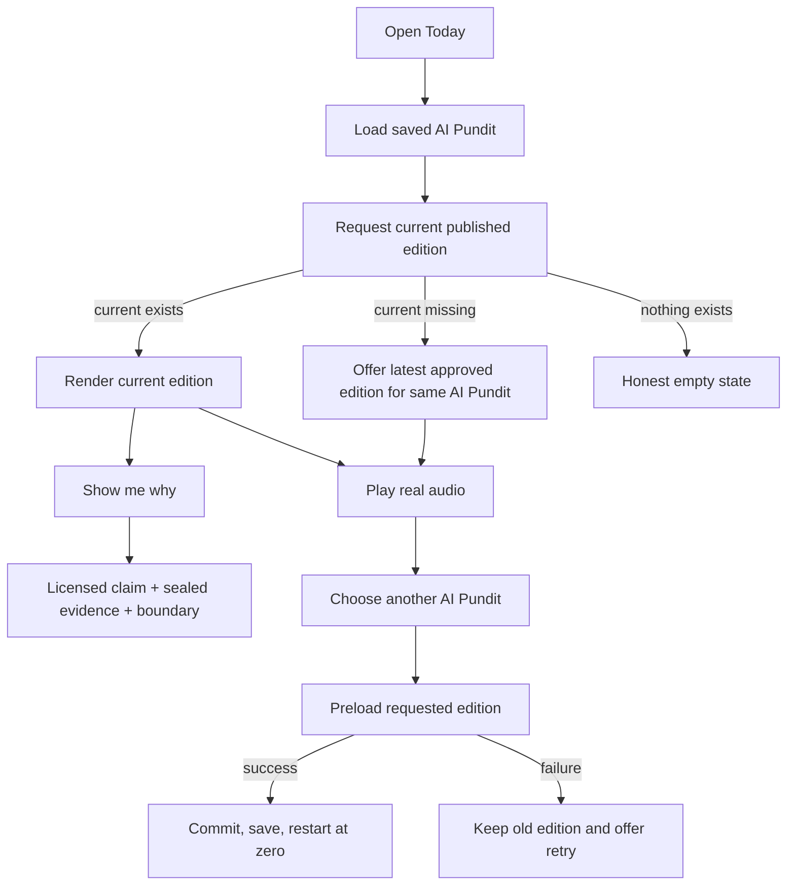
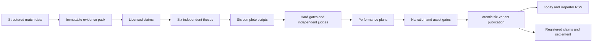

# 18 - AI Pundit system

- **Status:** Current implementation map
- **Owner:** Product and engineering
- **Purpose:** Describe what the repository implements, how Today reaches the production pipeline, and where its safety controls live.
- **Last reviewed:** 2026-08-11

## Implementation state

The repository implements an AI-native six-pundit production system and a player-first public Today surface. Production at [fulltime.fm](https://fulltime.fm) serves the three-tab shell and AI Pundit metadata. Automated public publication, new billing, and public forecast scores remain disabled.

The current product includes:

- six versioned internal `PunditSpec` records exposed publicly as six AI Pundits;
- a Today player within the first mobile viewport;
- coverage date, title, hook, AI Pundit picker, play or pause, seek, real-media progress, and playback failure states;
- safe AI Pundit switching that preloads requested media, restarts at zero, preserves play or pause intent, commits after load, and keeps the old edition on failure;
- local and signed-in AI Pundit preference persistence after successful switching;
- same-AI-Pundit latest fallback with the real coverage date;
- up to three public proof cards projected from sealed evidence and licensed claim IDs;
- recent published editions below the player;
- a conditional settled-record entry on Today;
- deterministic generated SVG avatars seeded by drop ID and AI Pundit ID;
- three public navigation items: Today, Teams, and Settings;
- a redirect from `/feed` to Today and a retained Reporter RSS endpoint;
- immutable evidence packs, licensed claims, independent judges, targeted repairs, audio checks, forecasts, settlement, atomic publication, and release readiness controls.

[`product-state.json`](./product-state.json) records the exact shipped behaviors and known product gaps.

## Public Today flow



Key code:

| Concern                                           | Canonical path                                                      |
| ------------------------------------------------- | ------------------------------------------------------------------- |
| Today route and data state                        | `src/routes/index.tsx`                                              |
| Player, picker, proof, recent, track-record entry | `src/components/TodayShowPlayer.tsx`                                |
| Real audio and transactional switching            | `src/lib/player-store.ts`                                           |
| Current, latest, proof, match, and team response  | `src/lib/api/editorial-public.server.ts`                            |
| Edition-to-player model                           | `src/lib/today-show-model.ts`                                       |
| Public AI Pundit copy                             | `src/components/PersonalitySelector.tsx`                            |
| Generated visual model                            | `src/components/PunditAvatar.tsx`, `src/lib/pundit/avatar-model.ts` |
| Public APIs                                       | `src/routes/api/public`                                             |

## Current public response

`GET /api/public/drops/today?pundit=<id>` returns:

- `coverageDate`;
- `state`: `prelaunch`, `off_day`, `variant_unavailable`, or `published`;
- the current `drop` and requested `variant` when published;
- `latest`, the newest other published edition for the same AI Pundit;
- `matchId` and `teamIds` from the sealed evidence pack;
- `proofCards`, capped at three;
- `recent`, up to four additional published editions for that AI Pundit.

The shareable variant route applies the same proof-card projection. A proof card is omitted when a licensed claim has no referenced item in the sealed evidence.

## Generated visual model

The avatar is deterministic procedural art. `punditAvatarModel` hashes `dropId:punditId`, then produces rotation, orbit, and dot values. `PunditAvatar` combines those values with one of six fixed motifs.

This gives each edition a fresh but stable abstract identity without a runtime image-generation provider. Tests verify stable output for the same seed and variation across editions and AI Pundits.

## Production pipeline



| Concern                           | Canonical path                                                                 |
| --------------------------------- | ------------------------------------------------------------------------------ |
| Types and contracts               | `src/lib/pundit/types.ts`                                                      |
| Internal AI Pundit specifications | `src/lib/pundit/specs.ts`                                                      |
| Evidence and claims               | `src/lib/pundit/evidence.ts`, `claim-lab.ts`                                   |
| Generation and judges             | `pundit-generator.server.ts`, `harness.ts`                                     |
| Performance and narration         | `performance.ts`, `src/lib/api/narration.server.ts`                            |
| Audio and assets                  | `audio-mastering.server.ts`, `asset-storage.server.ts`, `share-card.server.ts` |
| Forecasts and registered claims   | `forecast.ts`, `prediction-orchestrator.server.ts`                             |
| Daily orchestration               | `daily-orchestrator.server.ts`, `variant-production.server.ts`                 |
| Release evaluation                | `release-readiness.server.ts`                                                  |
| Durable workflow                  | `src/workflows/daily-pundit.ts`, `daily-pundit.steps.ts`                       |

## Safety switches

```text
VITE_PRELAUNCH_MODE=true
PRELAUNCH_MODE=true
VITE_BILLING_ENABLED=false
BILLING_ENABLED=false
ENABLE_PRIVATE_REHEARSALS=false
ENABLE_LEGACY_DAILY_DROP=false
PUNDIT_PUBLICATION_ENABLED=false
PUBLIC_FORECAST_SCORES_ENABLED=false
ENABLE_FORECAST_TRAINING=false
ENABLE_PREDICTION_REGISTRATION=false
ENABLE_EVALUATION_RUNS=false
ENABLE_RELEASE_SNAPSHOT_WRITE=false
```

Missing flags deny work. Checkout needs pre-launch explicitly false and both billing flags true. Each production capability has its own server flag.

## Current secondary-surface gaps

### Teams

The shell says Teams and keeps `/following` for compatibility. The current server function still returns all stored teams and leagues. The UI still puts teams first and tells new users to pick at least three. Premier-League-only availability, disabled coming-later leagues, and the removal of that minimum remain unimplemented.

### Track record

Today calls the settled-only receipts endpoint and shows **How did they do?** only when rows exist. The direct `/receipts` page still calls the predictions endpoint, shows search and filters, and includes open-record logic. It is unlisted in navigation but is not yet the simplified settled-only page.

### Settings

Settings persists AI Pundit choice, account state, notification state, disclosure, and existing billing management. Some copy retains generic pundit language and legacy seams.

## Schedules

[`vercel.ts`](../vercel.ts) schedules:

| UTC             | Endpoint                             | Responsibility                                        |
| --------------- | ------------------------------------ | ----------------------------------------------------- |
| 00:15           | `/api/public/cron/ingest`            | Structured-data ingest and settlement                 |
| 04:45           | `/api/internal/daily-rehearsal`      | Durable six-variant rehearsal or approved publication |
| 06:30 and 16:30 | `/api/internal/predictions-register` | Pre-kickoff registration                              |

Every request needs the exact cron bearer and its feature flag. GitHub workflows are manual recovery only.

## Database and release state

Production targets Supabase project `hzadscrqmyilbisexvyz`. Migrations are the schema authority. The available connector may lack access; never target a similarly named project.

Run:

```powershell
pnpm run docs:check
pnpm run typecheck
pnpm test
pnpm run lint
pnpm run build
git diff --check
```

Code cannot approve rights-cleared research, voices, provider capacity, forecast superiority, 360 scripts, blind review, seven daily rehearsals, or revision-bound legal and accessibility gates. See [`19-release-state.md`](./19-release-state.md).
